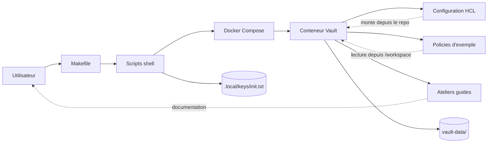

# Architecture

Ce lab fournit une instance locale de HashiCorp Vault executee dans Docker Compose, avec un stockage persistant sur disque et une documentation de prise en main.

## Objectif de l'architecture

Cette architecture cherche un compromis simple:

- facile a lancer sur un poste de travail
- assez proche d'un vrai serveur Vault pour apprendre
- reproductible pour d'autres utilisateurs du repo

## Schema


```

## Composants

### Utilisateur

L'utilisateur pilote le lab via `make` et les ateliers documentes.

### Makefile

Le `Makefile` standardise les commandes principales:

- `make up`
- `make init`
- `make unseal`
- `make login`
- `make status`
- `make down`

### Scripts shell

Les scripts du dossier `scripts/` encapsulent les commandes Docker et Vault pour rendre le lab plus lisible et plus simple a reutiliser.

### Docker Compose

`docker-compose.yml` orchestre un service unique `vault` expose sur:

- `8200` pour l'API et l'UI
- `8201` reserve au cluster address

### Conteneur Vault

Le conteneur execute l'image `hashicorp/vault:1.21.4` en mode serveur normal, avec un fichier de configuration HCL fourni par le repo.

### Configuration HCL

Le fichier [config/docker/vault.hcl](/root/Vault/config/docker/vault.hcl) definit:

- l'activation de l'UI
- l'ecoute TCP sans TLS pour un usage purement local
- le backend de stockage `file`

### Donnees persistantes

Le dossier `vault-data/` contient les donnees persistantes du serveur Vault.

Ce choix permet:

- de conserver l'etat du serveur entre deux redemarrages
- de comprendre le comportement d'un Vault initialise hors mode `dev`

### Secrets de bootstrap locaux

Le dossier `.local/` contient les artefacts locaux de bootstrap, en particulier:

- la cle de descellement
- le root token initial

Ils ne sont pas versionnes et doivent rester strictement locaux.

## Flux de fonctionnement

### 1. Demarrage

`make up` lance Docker Compose, cree le conteneur Vault et attend que le serveur soit joignable.

### 2. Initialisation

`make init` execute `vault operator init` dans le conteneur et stocke la sortie dans `.local/keys/init.txt`.

### 3. Descellement

`make unseal` relit la cle locale et execute `vault operator unseal`.

### 4. Authentification

`make login` relit le root token local et connecte la CLI dans le conteneur.

### 5. Exercices

Les ateliers du dossier `workshops/` s'appuient sur ce serveur local pour apprendre les moteurs de secrets, les policies, les tokens et les methodes d'authentification.

## Limites connues

Cette architecture est volontairement pedagogique. Elle n'a pas vocation a representer une architecture de production.

Differences majeures par rapport a un deploiement de production:

- pas de TLS
- un seul noeud
- backend `file` local
- root token stocke localement pour l'apprentissage
- absence d'audit device configure

## Evolutions possibles

Pistes d'amelioration pour le repo:

1. ajouter un audit device fichier
2. ajouter un mode TLS local
3. ajouter un atelier AppRole
4. ajouter un atelier Transit
5. ajouter un atelier PKI
